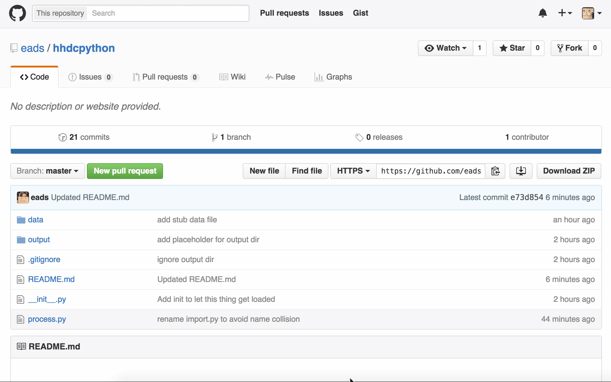

# Hacks/Hackers DC Python class instructions

It's your first week as a newsroom coder. A city reporter needs you to clean and summarize some data. She doesn't need anything fancy, but she does need it in a few hours.

Fortunately, one of your colleagues set up a repository with the dataset and an unfinished Python script with some notes. Unfortunately, the data is a real mess. Oh, and did I mention the data is in Spanish?

Now it's up to you to finish the job.

You'll make a copy your colleague's work by using Git's fork feature, install your copy on PythonAnywhere, then modify it to process the data.

By the end, you'll produce a clean CSV version of the data you can share with the reporter so she can analyze it in Excel. You'll also produce some basic analysis of the cleaned data to help her get started.

## Prerequisities

You'll need to sign up with a couple of services to complete this job:

* [Github](https://github.com)
* [Python Anywhere](https://pythonanywhere.com)

## Getting set up for the first time

At least your charmingly cryptic co-worker David left you a place to start: A git repository with some data and the bones of a script to process it.

Of course, David was only following the practices established for any small data project at your company. 

### Fork the code

Forking is a way of making your own version of someone else's code, usually because you want to improve it or modify it for your own purposes. At our company, you should always fork before you work on a project.

[Fork the repository for the class project](https://github.com/eads/hhdcpython#fork-destination-box) so you have your own copy of the code to hack on.



(You might think it's weird to digress into Git and version control so quickly. But this tutorial is meant to mimic a professional setting, and you're going to struggle a bit with version control in a professional setting.)

### Install the code on PythonAnywhere

Log in to [Python Anywhere](https://pythonanywhere.com).

The first screen is the "Consoles" tab. Under the "Start a new console" section at the top of the page, click "Bash".

This creates a basic terminal session where you can run and manage code.

{SCREENSHOT OF CREATING BASH SESSION}

Once you a prompt that looks like `11:11 ~ $`, you're ready to start typing in commands. Now it's time to get your copy of the code. Type the following into the terminal on your screen:

```
git clone https://github.com/<MYGITHUBUSERNAME>/hhdcpython
```

Note that you **must** replace `<MYGITHUBUSERNAME>` with your Github username.

{SCREENSHOT OF CLONING REPO}

## Editing and running the script

Click the "Files" tab.
